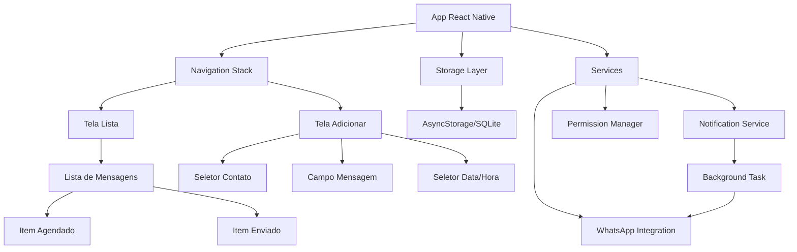
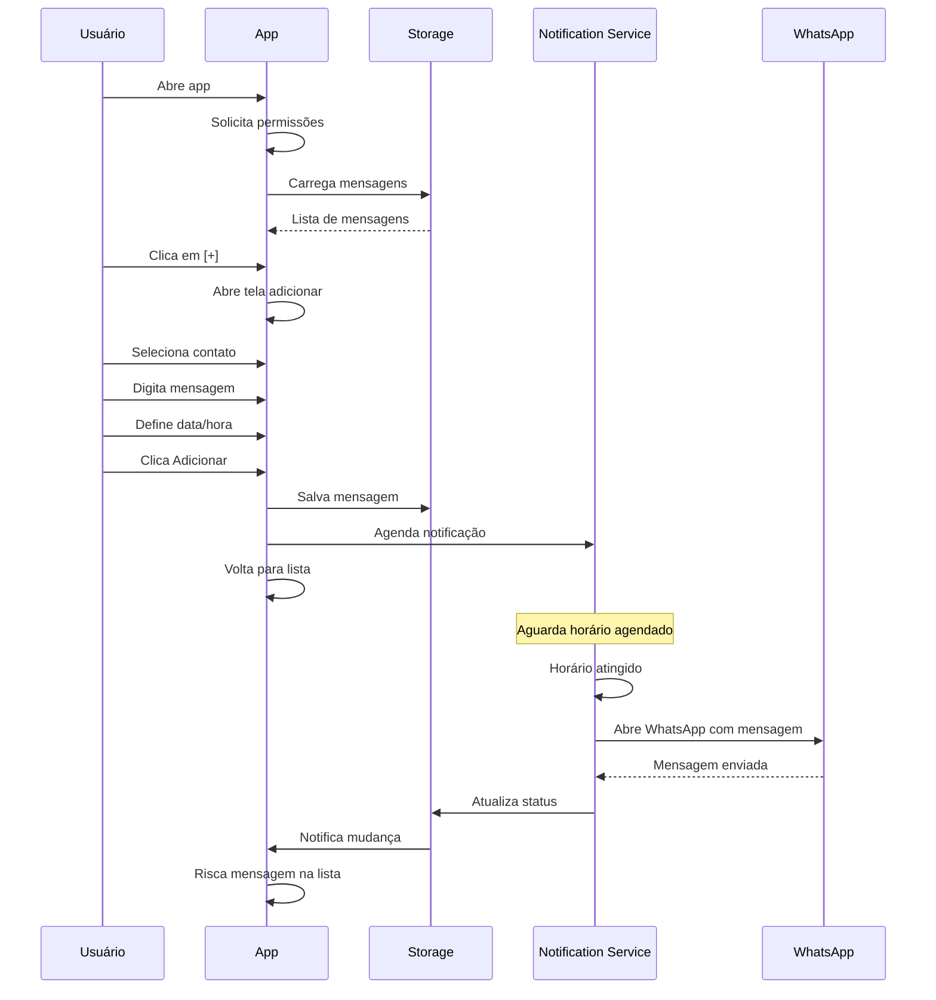

# 📱 Agendador de Mensagens WhatsApp - Plano de Desenvolvimento

## 🎯 Visão Geral do Projeto

Aplicativo Android nativo para agendamento de mensagens do WhatsApp, desenvolvido em **React Native** com TypeScript.

## 🏗️ Arquitetura do Sistema



## 📋 Especificações Técnicas

### Stack Tecnológica
- **Framework**: React Native 0.73+
- **Linguagem**: TypeScript
- **Navegação**: React Navigation 6
- **Estado**: Context API + AsyncStorage
- **UI Components**: React Native Paper
- **Notificações**: @notifee/react-native
- **Agendamento**: react-native-background-actions
- **Contatos**: react-native-contacts
- **Data/Hora**: @react-native-community/datetimepicker
- **Storage**: @react-native-async-storage/async-storage
- **Linking**: react-native-linking (WhatsApp)

### Permissões Necessárias (AndroidManifest.xml)
```xml
- READ_CONTACTS
- SCHEDULE_EXACT_ALARM
- POST_NOTIFICATIONS
- WAKE_LOCK
- REQUEST_IGNORE_BATTERY_OPTIMIZATIONS
```

## 🎨 Estrutura de Telas

### 1. Tela de Lista (HomeScreen)
```
┌─────────────────────────────┐
│  Mensagens Agendadas    ⚙️  │
├─────────────────────────────┤
│                             │
│  📱 João Silva              │
│  "Feliz aniversário!"       │
│  ⏰ 29/04 às 09:00         │
│  ────────────────────────   │
│                             │
│  📱 Maria Santos (enviada)  │
│  "Reunião confirmada"       │
│  ✓ 28/04 às 14:30          │
│  ────────────────────────   │
│                             │
│                             │
│                             │
│                      [+]    │
└─────────────────────────────┘
```

### 2. Tela de Adicionar (AddMessageScreen)
```
┌─────────────────────────────┐
│  ← Nova Mensagem            │
├─────────────────────────────┤
│                             │
│  Destinatário:              │
│  [Selecionar Contato... 📱] │
│                             │
│  Mensagem:                  │
│  ┌─────────────────────────┐│
│  │                         ││
│  │                         ││
│  │                         ││
│  └─────────────────────────┘│
│                             │
│  Agendar para:              │
│  📅 29/04/2026  🕐 09:00   │
│                             │
│                             │
│  [Cancelar]    [Adicionar]  │
└─────────────────────────────┘
```

## 📊 Modelo de Dados

```typescript
interface ScheduledMessage {
  id: string;
  contactName: string;
  contactPhone: string;
  message: string;
  scheduledDate: Date;
  status: 'pending' | 'sent' | 'failed';
  createdAt: Date;
  sentAt?: Date;
}
```

## 🔄 Fluxo de Funcionamento



## 🔐 Sistema de Permissões

### Fluxo de Solicitação
1. **Primeira abertura**: Solicita todas as permissões essenciais
2. **Permissões críticas**: READ_CONTACTS, POST_NOTIFICATIONS
3. **Permissões de bateria**: REQUEST_IGNORE_BATTERY_OPTIMIZATIONS
4. **Fallback**: Se negadas, mostra tela explicativa

## 🚀 Integração com WhatsApp

### Método de Envio
```typescript
// Usando Intent do Android via Linking
const sendWhatsAppMessage = (phone: string, message: string) => {
  const url = `whatsapp://send?phone=${phone}&text=${encodeURIComponent(message)}`;
  Linking.openURL(url);
};
```

### Limitações
- Requer WhatsApp instalado
- Usuário precisa confirmar envio manualmente
- Não é possível envio 100% automático (política do WhatsApp)

## 📁 Estrutura de Pastas

```
agendador-zap/
├── src/
│   ├── components/
│   │   ├── MessageItem.tsx
│   │   ├── FloatingButton.tsx
│   │   ├── ContactPicker.tsx
│   │   └── DateTimePicker.tsx
│   ├── screens/
│   │   ├── HomeScreen.tsx
│   │   └── AddMessageScreen.tsx
│   ├── services/
│   │   ├── storageService.ts
│   │   ├── notificationService.ts
│   │   ├── whatsappService.ts
│   │   └── permissionService.ts
│   ├── contexts/
│   │   └── MessagesContext.tsx
│   ├── types/
│   │   └── index.ts
│   ├── utils/
│   │   └── dateUtils.ts
│   └── navigation/
│       └── AppNavigator.tsx
├── android/
│   └── app/
│       └── src/
│           └── main/
│               └── AndroidManifest.xml
├── App.tsx
├── package.json
└── tsconfig.json
```

## ⚙️ Configurações Importantes

### Android Build.gradle
```gradle
minSdkVersion = 24
targetSdkVersion = 33
compileSdkVersion = 33
```

### Otimizações de Bateria
- Solicitar exclusão de otimização de bateria
- Usar WorkManager para tarefas em background
- Implementar wake locks quando necessário

## 🎯 Funcionalidades Principais

### ✅ Tela de Lista
- Lista scrollável de mensagens
- Indicador visual de status (pendente/enviado)
- Botão flutuante (+) fixo
- Swipe para deletar
- Tap para editar/visualizar

### ✅ Tela de Adicionar
- Seletor de contatos nativo
- TextArea com contador de caracteres
- Date/Time picker com valor padrão (agora)
- Validação de campos
- Botões Cancelar e Adicionar

### ✅ Sistema de Agendamento
- Notificação local no horário agendado
- Abertura automática do WhatsApp
- Mensagem pré-preenchida
- Atualização de status após envio

### ✅ Persistência
- Armazenamento local de mensagens
- Sincronização de status
- Backup automático

## 🧪 Testes Necessários

1. **Permissões**: Testar concessão/negação
2. **Agendamento**: Testar diferentes horários
3. **WhatsApp**: Testar com/sem app instalado
4. **Background**: Testar com app fechado
5. **Bateria**: Testar com otimização ativa
6. **Contatos**: Testar seleção e busca
7. **Exclusão**: Testar remoção de mensagens
8. **Edição**: Testar modificação de agendamentos

## 📱 Requisitos do Dispositivo

- **Android**: 7.0+ (API 24+)
- **RAM**: Mínimo 2GB
- **WhatsApp**: Instalado e configurado
- **Permissões**: Todas concedidas

## 🚀 Dependências do Projeto

```json
{
  "dependencies": {
    "react": "18.2.0",
    "react-native": "0.73.0",
    "@react-navigation/native": "^6.1.9",
    "@react-navigation/stack": "^6.3.20",
    "react-native-paper": "^5.11.0",
    "@notifee/react-native": "^7.8.0",
    "react-native-background-actions": "^3.0.0",
    "react-native-contacts": "^7.0.8",
    "@react-native-community/datetimepicker": "^7.6.1",
    "@react-native-async-storage/async-storage": "^1.21.0",
    "react-native-gesture-handler": "^2.14.0",
    "react-native-safe-area-context": "^4.8.0",
    "react-native-screens": "^3.29.0"
  },
  "devDependencies": {
    "@types/react": "^18.2.0",
    "@types/react-native": "^0.73.0",
    "typescript": "^5.3.0"
  }
}
```

## 📝 Notas de Implementação

### Desafios Conhecidos
1. **Envio Automático**: WhatsApp não permite envio 100% automático por questões de segurança
2. **Background Tasks**: Android 12+ tem restrições severas em tarefas em background
3. **Bateria**: Dispositivos Samsung podem ter otimizações agressivas

### Soluções Propostas
1. Usar notificação que abre WhatsApp com mensagem pré-preenchida
2. Solicitar exclusão de otimização de bateria
3. Implementar WorkManager para maior confiabilidade
4. Adicionar instruções claras para o usuário sobre permissões

## 🔄 Roadmap Futuro

### Fase 1 (MVP)
- ✅ Funcionalidades básicas descritas acima

### Fase 2 (Melhorias)
- Templates de mensagens
- Mensagens recorrentes (diárias, semanais)
- Grupos do WhatsApp
- Histórico de mensagens enviadas

### Fase 3 (Avançado)
- Backup na nuvem
- Múltiplos destinatários
- Anexos (imagens, documentos)
- Estatísticas de uso